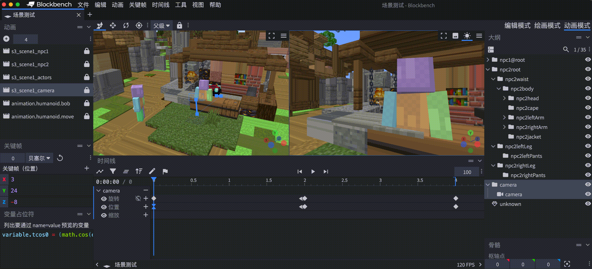

# Blockbench Scene Tool

这是一个用于 Blockbench 的简单的插件，旨在直接使用 BlockBench 制作 **游戏内** 可用的CG镜头与对应动画。



## 功能特性

### 1. 骨骼前缀管理
- **添加骨骼前缀**：为选中的骨骼及其子骨骼添加指定前缀
- 前缀格式：`{前缀}@{原始骨骼名}`

### 2. 动画导出
- **动画导出（过滤前缀）**：导出动画时自动移除骨骼名称中的前缀部分，便于在游戏引擎中使用

## 安装方法

### 在线URL安装
1. 打开 Blockbench
2. 点击 `文件 > 插件 > 从URL加载插件`
3. 输入URL `https://raw.githubusercontent.com/EaseCation/blockbench-scene-tool/refs/heads/main/dist/scene-tool.js`
4. 点击确认，插件将自动下载并安装

### 本地文件安装
1. 下载最新的 `scene-tool.js` 文件
2. 在 Blockbench 中，点击 `文件 > 插件 > 加载插件 > 从文件加载`
3. 选择下载好的 `scene-tool.js` 文件
4. 重启 Blockbench 以完成安装

## 使用方法

### 添加骨骼前缀

1. 在场景中选择一个或多个骨骼
2. 点击 `工具 > 添加骨骼前缀`
3. 在弹出的对话框中输入前缀名称
4. 点击确认，所选骨骼及其子骨骼将被添加指定前缀

### 导出带前缀的动画

1. 选择要导出的动画
2. 点击 `工具 > 动画导出（过滤前缀）` 
3. 选择保存路径
4. 导出的 JSON 文件中，骨骼名称将自动移除前缀部分（`@` 之前的内容）

## 开发

### 环境设置

```bash
# 安装依赖
npm install

# 开发模式构建（带监视）
npm run dev

# 生产模式构建
npm run build
```

### 项目结构

- index.ts - 插件入口点
- plugin.ts - 插件注册和初始化
- actions - 包含各种功能实现
  - bone-prefix.ts - 骨骼前缀功能
  - animation-export.ts - 动画导出功能
- dialogs - 用户界面对话框
- utils - 实用工具

## 许可证

MIT

## 作者

boybook